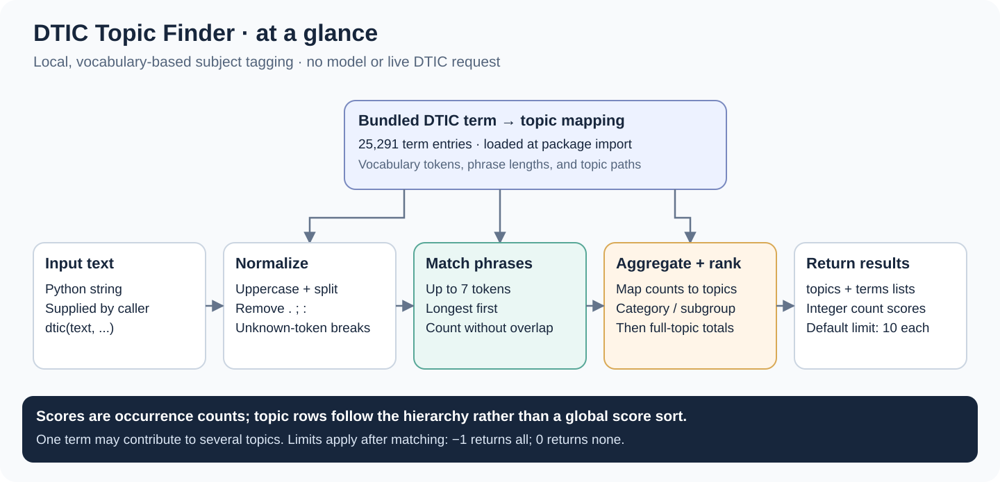

# DTIC Topic Finder

**Match text to DTIC subject terms and aggregate their subject-category topics.**

DTIC Topic Finder is a small, local Python library built around a bundled mapping of **25,291 subject-term entries**. It uses exact vocabulary phrase matching and occurrence counts to return terms and topic paths. Matching runs locally after installation, without a model, API key, or live DTIC request.

The vocabulary originates from the [Defense Technical Information Center's thesaurus](https://discover.dtic.mil/thesaurus/) and [subject-category taxonomy](https://discover.dtic.mil/thesaurus/subject-categories/). This repository's bundled mapping is a snapshot; it does not automatically download later DTIC updates.

## At a glance



## Install

Use **Python 3.8 or newer**. The implementation imports `typing.TypedDict`; the existing package metadata's `>=3.6` declaration does not reflect that requirement.

Install this repository directly:

```sh
python -m pip install "git+https://github.com/stauntonjr/dtic-topic-finder.git"
```

Or install a local checkout:

```sh
git clone https://github.com/stauntonjr/dtic-topic-finder.git
cd dtic-topic-finder
python -m pip install .
```

The distribution is named `dtic-topic-finder-stauntonjr`; the Python import is `dtic_topic_finder`. The vocabulary JSON is included in the installed package.

## Use

```python
from dtic_topic_finder import dtic

result = dtic(
    "i like supersonic wind tunnels.",
    max_topics=1,
    max_terms=1,
)
print(result)
```

Output:

```python
{
    "topics": [
        {
            "topic": "AVIATION TECHNOLOGY; AERODYNAMICS; AERODYNAMICS",
            "score": 1,
        }
    ],
    "terms": [{"term": "SUPERSONIC WIND TUNNELS", "score": 1}],
}
```

One term can contribute to several topics. The example limits the output to one topic and one term; it does not restrict which vocabulary entries are considered.

| Argument | Default | Meaning |
| --- | --- | --- |
| `text` | Required | Input text as a string |
| `max_topics` | `10` | Maximum topic results; `-1` returns all, `0` returns none |
| `max_terms` | `10` | Maximum term results; `-1` returns all, `0` returns none |

```python
# Return every matched term and topic.
all_results = dtic("i like perigees and aphelions.", max_topics=-1, max_terms=-1)

# Unmatched text returns empty lists.
assert dtic("i do not like anything.") == {"topics": [], "terms": []}
```

## Matching and scoring

1. The package loads [`dtic_term_to_topic.json`](src/dtic_topic_finder/dtic_term_to_topic.json) and indexes vocabulary phrases by token length.
2. Input is uppercased, periods/semicolons/colons are removed, and whitespace separates tokens. Tokens absent from the vocabulary token set delimit candidate spans.
3. Within each candidate span, the matcher tries phrases of up to **seven tokens**, longest first. It takes the first match at that length and recursively searches the remaining left and right spans, avoiding overlapping matches.
4. A term's integer `score` is its matched occurrence count. Every occurrence contributes to each mapped topic, and counts are aggregated at the category, subcategory, and full topic levels.
5. Terms are ordered by descending count. Topics are grouped by descending category totals, then descending subcategory totals, then full-topic totals. **Topic output is not globally sorted by each row's score.** The requested list limits are applied last.

A topic path has three fields: `category; subcategory; subsubcategory`. Some bundled paths repeat a field. Scores are counts, rather than probabilities or calibrated confidence values; a topic can receive a larger score because several matched terms map to it.

Matching is case-insensitive but otherwise vocabulary-based. There is no learned semantic similarity, stemming, automatic synonym expansion, or general punctuation cleanup. Other punctuation and changed word forms can prevent a match. Empty result lists indicate that no supported phrase matched, rather than that the document has no relevant subject matter.

The exported `dtic` callable is a shared instance that stores intermediate counts. For concurrent use, create a separate `DTICTopicFinder` instance per worker or serialize access to that instance.

## Include in an image build

Add this GitHub repository as a submodule:

```sh
git submodule add https://github.com/stauntonjr/dtic-topic-finder.git _submodules/dtic-topic-finder
```

From an existing checkout with that submodule, initialize it before building:

```sh
git submodule update --init --recursive
```

In a Python image, with the parent repository as the build context:

```dockerfile
COPY _submodules/dtic-topic-finder /tmp/dtic-topic-finder
RUN python -m pip install --no-cache-dir /tmp/dtic-topic-finder
```

## Development check

The matching module includes doctest examples. From the repository root, enter the package source directory so the examples can find their vocabulary JSON:

```sh
cd src/dtic_topic_finder
python -m doctest -v dtic_topic_finder.py
```

## Repository map

| File | Purpose |
| --- | --- |
| [`src/dtic_topic_finder/__init__.py`](src/dtic_topic_finder/__init__.py) | Load the packaged vocabulary and expose `dtic` |
| [`src/dtic_topic_finder/dtic_topic_finder.py`](src/dtic_topic_finder/dtic_topic_finder.py) | Phrase matching, counts, topic ordering, and callable API |
| [`src/dtic_topic_finder/dtic_term_to_topic.json`](src/dtic_topic_finder/dtic_term_to_topic.json) | Bundled term-to-topic mapping |
| [`setup.cfg`](setup.cfg) and [`MANIFEST.in`](MANIFEST.in) | Package metadata and bundled JSON inclusion |

The library code uses the [MIT license](LICENSE.txt). DTIC is the originator of the thesaurus; its [terms of use](https://discover.dtic.mil/thesaurus/) apply to that vocabulary.
